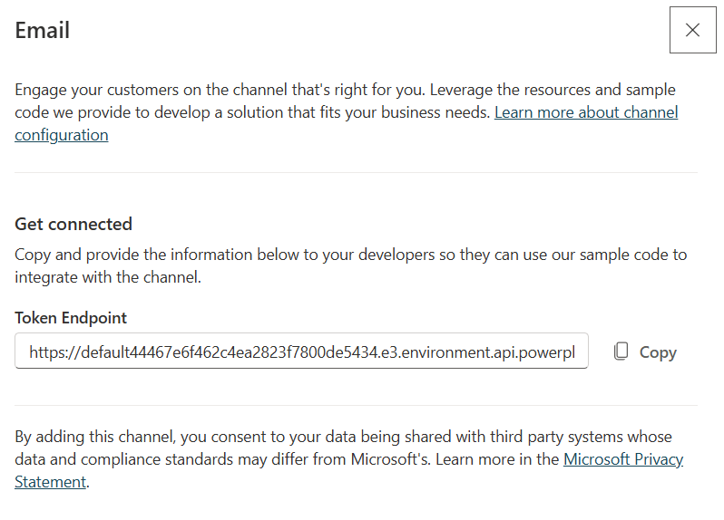

# chatbot-copilot-client
Contains template code that can be added to a website to integrate with Copilot Studio. University branded and vetted for accessibility.

This was generated as part of the IT ProForum 2026 presentation. Links are at:

* https://itproforum.illinois.edu/eventdesc/1-spring-2026/1-1pm/from-idea-to-agent-building-your-first-chatbot-with-copilot-studio/
* https://go.illinois.edu/itpf2026-resources

## Files

* index.html: template that has the chatbot information
* chatbot.js: JavaScript that contains chatbot connection information
* chatbot.css: CSS style that contains chatbot styling

index.html needs to have the following:
```
    <script src="https://cdn.botframework.com/botframework-webchat/latest/webchat.js"></script>
    <script src="chatbot.js"></script>
    <link rel="stylesheet" href="chatbot.css"></script>
```

Then in the body where you want the button, add this:
```
<div id="illinois-webchat" role="none"
     data-endpoint=""
     data-bot-image=""
     data-user-image=""></div>
```

You get the endpoint by going to Copilot Studio Agent and choosing Channels --> Email. Copy the token endpoint for this. 



Put this endpoint in the `data-endpoint` attribute in the `<div>` tag. 

For `data-bot-image` and `data-user-image` attributes, you can include paths to images. If you delete these attributes, it will default to generic images.

### Resources

* https://learn.microsoft.com/en-us/azure/bot-service/bot-builder-webchat-overview?view=azure-bot-service-4.0 

## Activation

You can start the chatbot by calling `showChat()` on a button click. Note that when this starts, it will use a Copilot Credit, so only do this when the user wants to intiate a chat. Do not run this on `window.load()`.

### Copilot Licensing Links:

* https://azure.microsoft.com/en-us/pricing/details/copilot-studio/
* https://learn.microsoft.com/en-us/microsoft-365/copilot/pay-as-you-go/copilot-capacity-packs 


