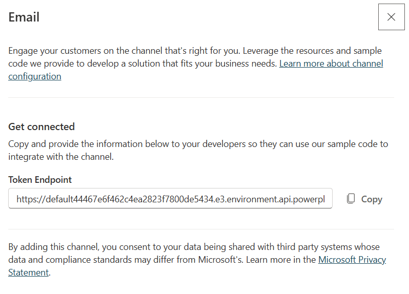
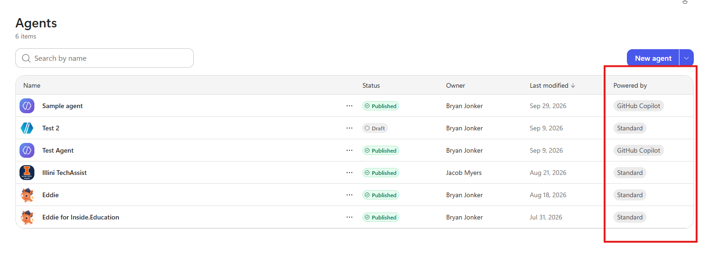

# chatbot-copilot-client
Contains template code that can be added to a website to integrate with Copilot Studio. University branded and vetted for accessibility.

This was generated as part of the IT ProForum 2026 presentation. Links are at:

* https://itproforum.illinois.edu/eventdesc/1-spring-2026/1-1pm/from-idea-to-agent-building-your-first-chatbot-with-copilot-studio/
* https://go.illinois.edu/itpf2026-resources

## Files

**Note that this is only for Standard Agents, see GitHub Copilot versus Standard Agents addendum below**

* index.html: template that has the chatbot information
* chatbot.js: JavaScript that contains chatbot connection information
* chatbot.css: CSS style that contains chatbot styling
* bot.png, user.png: sample graphic files to show up in the chatbot

index.html needs to have the following:
```
    <script>
      generateEndpoint(' ** token endpoint here ** ');
      generateBotAndUserImages(' ** bot image here ** ', ' ** user image here ** ');
    </script>
```

You get the endpoint by going to Copilot Studio Agent and choosing Channels --> Email. Copy the token endpoint for this. 



### Resources

* https://learn.microsoft.com/en-us/azure/bot-service/bot-builder-webchat-overview?view=azure-bot-service-4.0 

## Activation

You can start the chatbot by calling `showChat()` on a button click. Note that when this starts, it will use a Copilot Credit, so only do this when the user wants to intiate a chat. Do not run this on `window.load()`.

### Copilot Licensing Links:

* https://azure.microsoft.com/en-us/pricing/details/copilot-studio/
* https://learn.microsoft.com/en-us/microsoft-365/copilot/pay-as-you-go/copilot-capacity-packs 

## GitHub Copilot versus Standard Agents

Shortly after building this, Microsoft Copilot introduced the concept of "Powered By". The above is for Standard, but the default is (as of 9/30/2026) GitHub Copilot. You can check the difference by seeing the agent list. 



The GitHub Copilot has fewer channels (https://learn.microsoft.com/en-us/microsoft-copilot-studio/agents-experience/publication-channels-overview#web-and-app-channels), and you cannot deploy the agent with a native app token. Instead, you need to wrap the assigned webpage in an iframe. This means you do not have as much control over the interface. 

We have an example of this below. 

### Files with GitHub Copilot option

* index_copilot.html: template that has the chatbot information
* chatbot_copilot.js: JavaScript that contains chatbot connection information
* chatbot_copilot.css: CSS style that contains chatbot styling

index_copilot.html needs to have the following:
```
    <script>
      generateEndpoint(' ** chatbot title ** ', ' ** chatbot web URL ** ');
    </script>
```

The chatbot title is whatever you want the title of the chatbot to be. 

You get the chatbot web URL by going to Copilot Studio Agent and choosing the arrow by the Publish Drodown. Go to the "Web app" and find the `<iframe src="...">`. Copy the item inside the `src` variable and put it as the chatbot web URL. Alternatively, you can just copy the "Demo website" and replace `canvas?` with `webchat?`.

### Activation with GitHub Copilot option

You can start the chatbot by calling `showChat()` on a button click. Note that when this starts, it will use a Copilot Credit, so only do this when the user wants to intiate a chat. Do not run this on `window.load()`.

## CSS Variables

We have some variables you can manipulate:

* --chat-heading-height: 65px;
* --chat-button-right: 32px;
* --chat-button-bottom: 32px;
* --chat-color: var(--il-blue);
* --chat-color-hover: var(--il-altgeld); 
* --chat-transition-speed: 0.3s;
